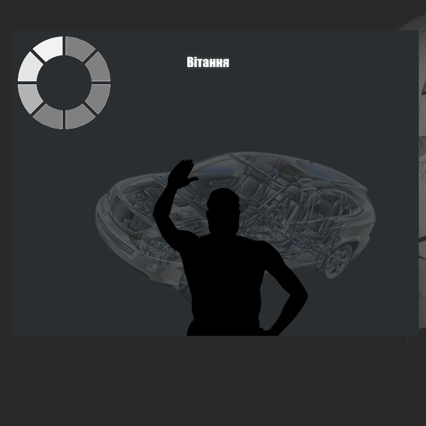
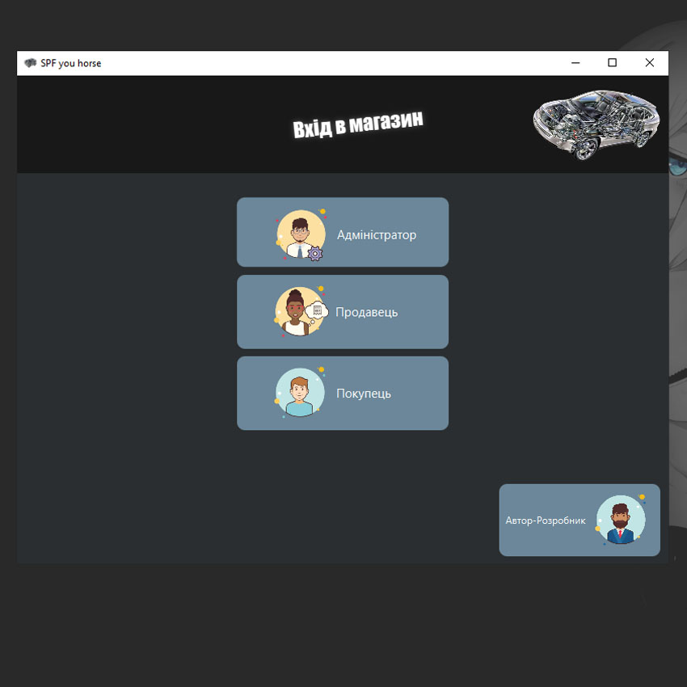
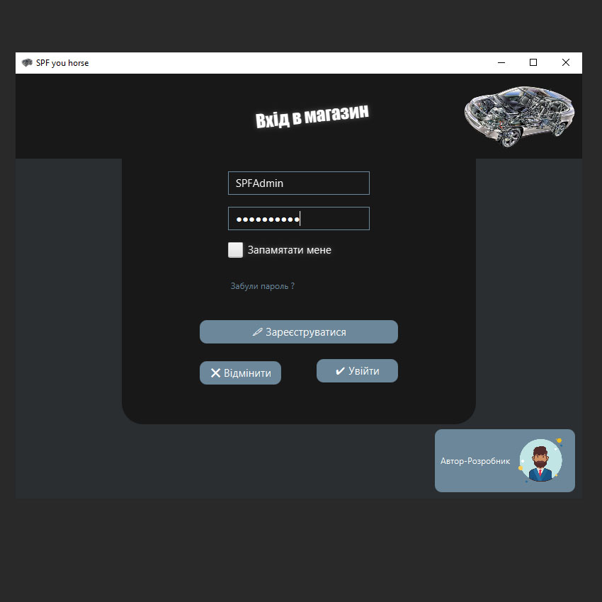
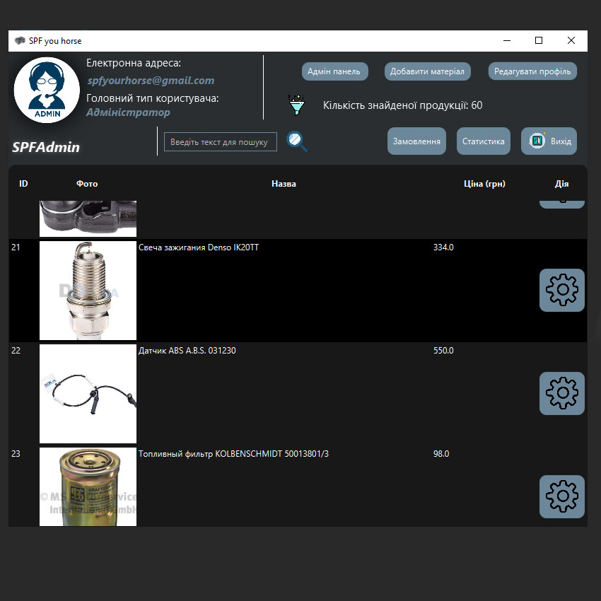
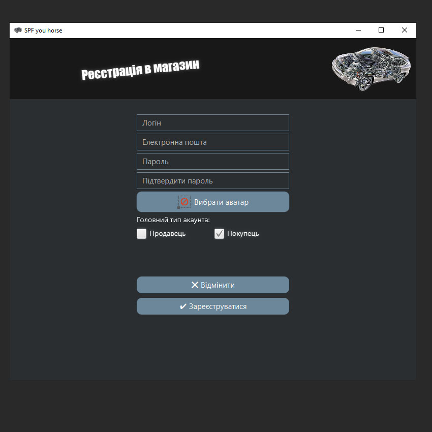
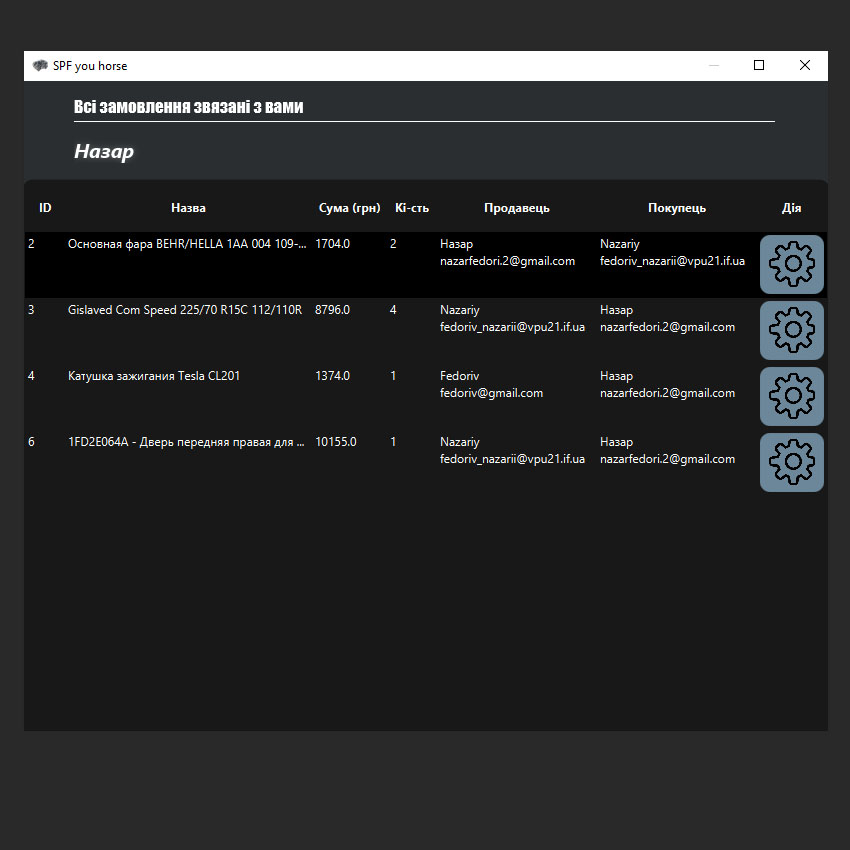
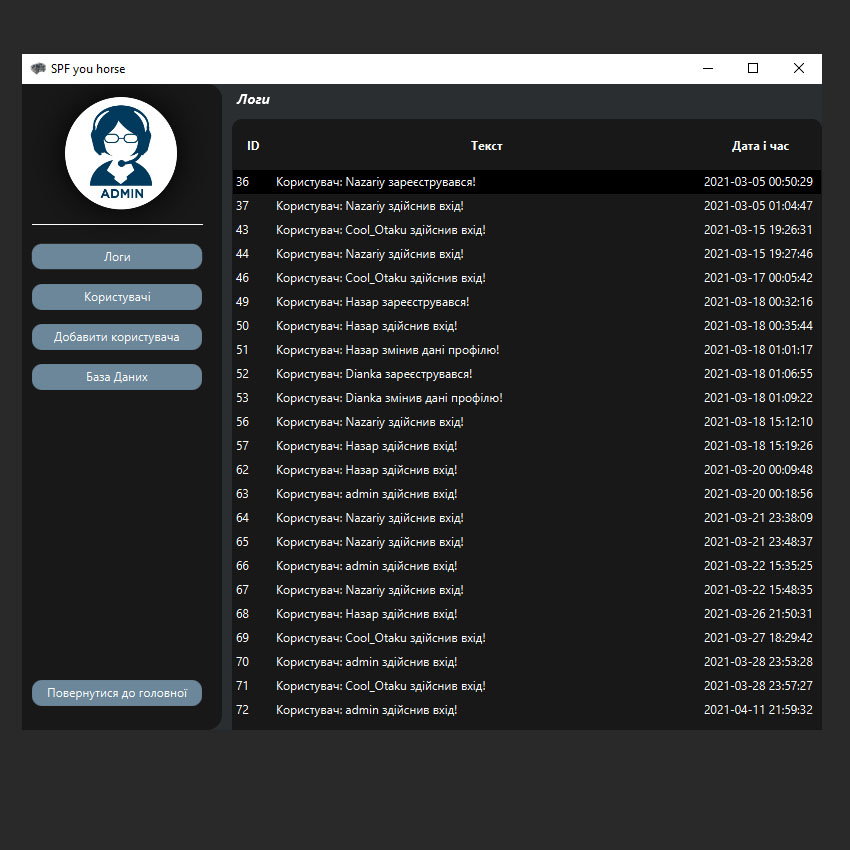
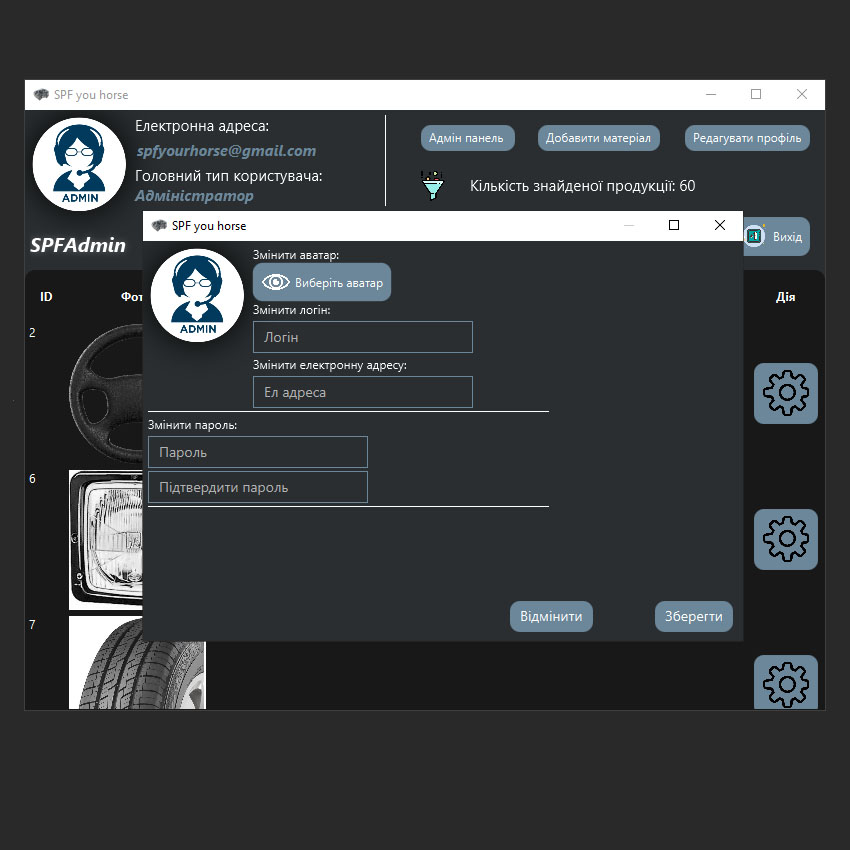

<p align="center"></p>
<h1 align="center">SPF_your_horse</h1>

## Description
<b>EN:</b>

This is course-work created on JavaFx. Online store selling auto parts.

<b>UA:</b>

Це курсова робота, створена на JavaFx. Інтернет магазин з продажу автозапчастин.

#
## Screenshots
<p>
  
  
  
  
  
  
  
  
</p>

#
## Technologies used
<b>EN:</b>
- Using the JavaFX library to create a graphical user interface
- Using the MySQL database (mysql-connector-java-8.0.23)
- Work with JSON format (com.googlecode.json-simple:json-simple:1.1.1)
- Sending messages from the program to the user by e-mail (com.sun.mail:javax.mail:1.6.0)
- Full user system (Administrators, Sellers and Buyers)
- User activity registration system
- Internal authorization system

<b>UA:</b>
- Використання бібліотеки JavaFX для створення графічного користувацького інтерфейсу
- Використання бази даних MySQL (mysql-connector-java-8.0.23)
- Робота з форматом JSON (com.googlecode.json-simple:json-simple:1.1.1)
- Відправка повідомлень від програми до користувача електронною поштою (com.sun.mail:javax.mail:1.6.0)
- Повноцінна система користувачів (Адміністратори, Продавці та Покупці)
- Система реєстрації активності користувачів
- Внутрішня система авторизації
#
## License
```
© 2021, CoolOtaku (ericspz531@gmail.com)
```
